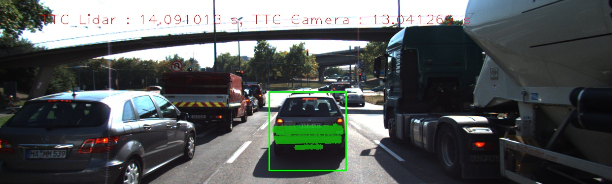
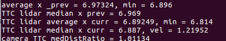
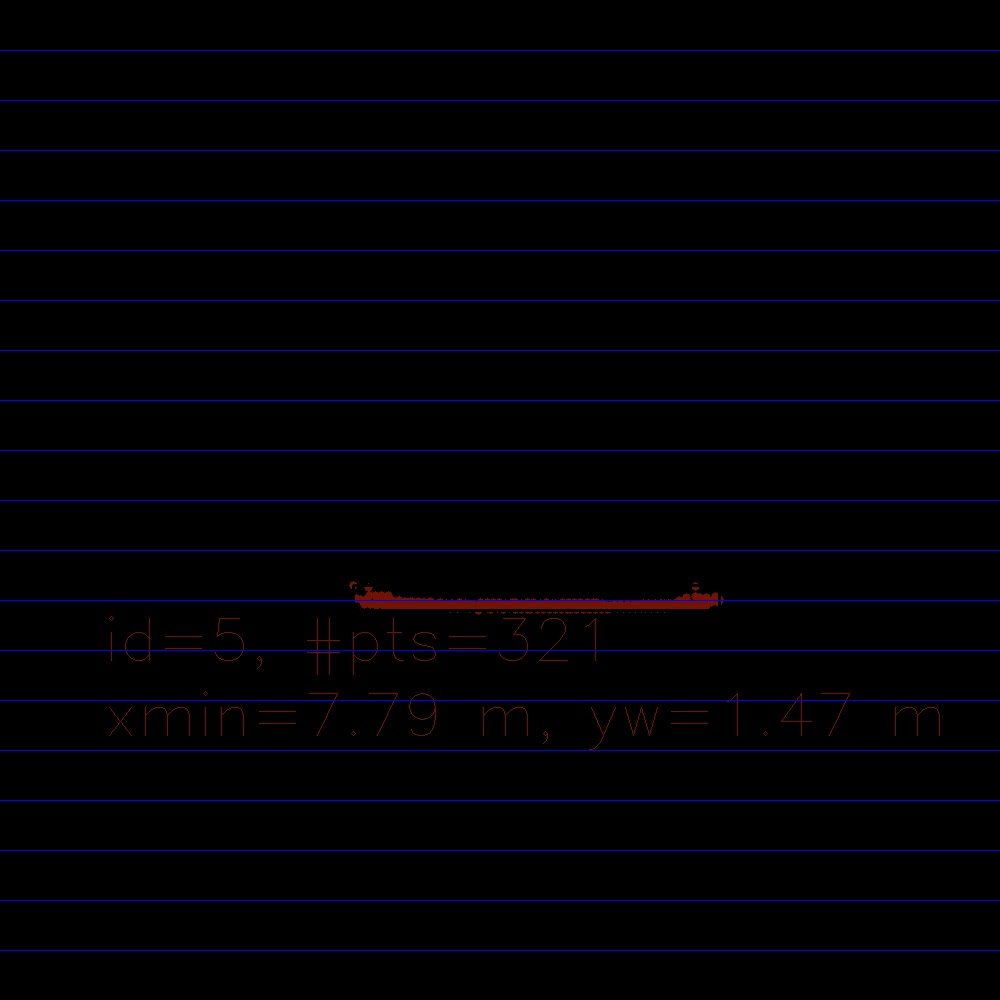
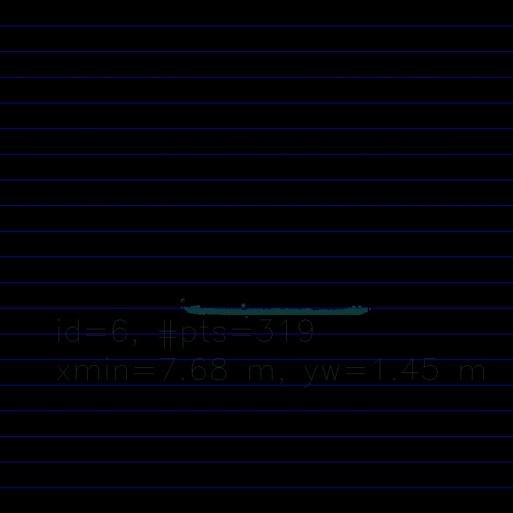
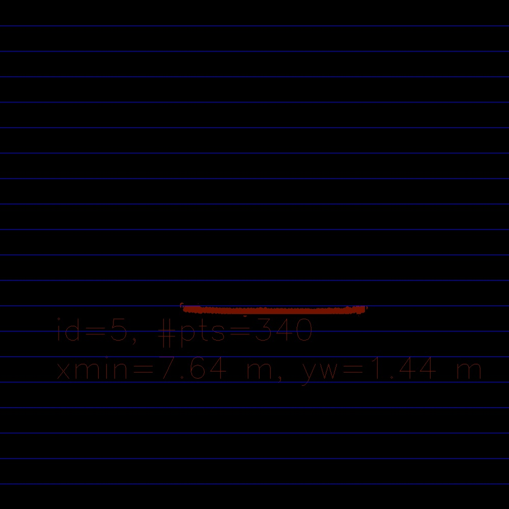
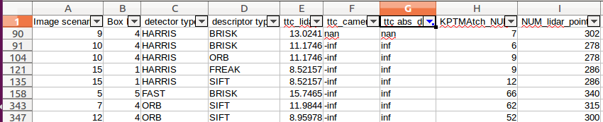

# SFND 3D Object Tracking

Welcome to the final project of the camera course. By completing all the lessons, you now have a solid understanding of keypoint detectors, descriptors, and methods to match them between successive images. Also, you know how to detect objects in an image using the YOLO deep-learning framework. And finally, you know how to associate regions in a camera image with Lidar points in 3D space. Let's take a look at our program schematic to see what we already have accomplished and what's still missing.

In this final project, you will implement the missing parts in the schematic. To do this, you will complete four major tasks: 
1. First, you will develop a way to match 3D objects over time by using keypoint correspondences. 
2. Second, you will compute the TTC based on Lidar measurements. 
3. You will then proceed to do the same using the camera, which requires to first associate keypoint matches to regions of interest and then to compute the TTC based on those matches. 
4. And lastly, you will conduct various tests with the framework. Your goal is to identify the most suitable detector/descriptor combination for TTC estimation and also to search for problems that can lead to faulty measurements by the camera or Lidar sensor. In the last course of this Nanodegree, you will learn about the Kalman filter, which is a great way to combine the two independent TTC measurements into an improved version which is much more reliable than a single sensor alone can be. But before we think about such things, let us focus on your final project in the camera course. 

## Dependencies for Running Locally
* cmake >= 2.8
  * All OSes: [click here for installation instructions](https://cmake.org/install/)
* make >= 4.1 (Linux, Mac), 3.81 (Windows)
  * Linux: make is installed by default on most Linux distros
  * Mac: [install Xcode command line tools to get make](https://developer.apple.com/xcode/features/)
  * Windows: [Click here for installation instructions](http://gnuwin32.sourceforge.net/packages/make.htm)
* Git LFS
  * Weight files are handled using [LFS](https://git-lfs.github.com/)
* OpenCV >= 4.1
  * This must be compiled from source using the `-D OPENCV_ENABLE_NONFREE=ON` cmake flag for testing the SIFT and SURF detectors.
  * The OpenCV 4.1.0 source code can be found [here](https://github.com/opencv/opencv/tree/4.1.0)
* gcc/g++ >= 5.4
  * Linux: gcc / g++ is installed by default on most Linux distros
  * Mac: same deal as make - [install Xcode command line tools](https://developer.apple.com/xcode/features/)
  * Windows: recommend using [MinGW](http://www.mingw.org/)

## Basic Build Instructions

1. Clone this repo.
2. Make a build directory in the top level project directory: `mkdir build && mkdir output && cd build`
3. Compile: `cmake .. && make`
4. Run it: `./3D_object_tracking`.

## Project rubric points
### FP.0 Final Report
This is the report that include the information for this project.

### FP.1 Match 3D Objects:
- Implement the method "matchBoundingBoxes", which takes as input both the previous and the current data frames and provides as output the ids of the matched regions of interest (i.e. the boxID property). Matches must be the ones with the highest number of keypoint correspondences.
- The code is functional as it get the keypoints matches between the current and previous frames and a loop over all the bounding boxes of the previous and current frames and put the box ids in multimap 
data stucture. after that for each found current box find in the multimap the corresponding previousb boxes in another multimap with pair (prev box ids, current box id ) to get the count of each occurance happen of this current box and previous boxes, so that the boxes with high count will be the best matching bounding boxes between the current and previous.

### FP.2 Compute Lidar-based TTC
- Compute the time-to-collision in second for all matched 3D objects using only Lidar measurements from the matched bounding boxes between current and previous frame. 

The code functionality is to get the average, minimum of the lidar point x position in the previous and current frame, I make also a median filtering to remove the outiliers, analysis is done on which perform better (average, minimum or median), it is found median is the better perfomance to remove the outliers.

### FP.3 Associate Keypoint Correspondences with Bounding Boxes

 - Code performs as described and adds the keypoint correspondences to the "kptMatches" property of the respective bounding boxes. Also, outlier matches have been removed based on the euclidean distance between them in relation to all the matches in the bounding box. 

This is done on the function "clusterKptMatchesWithROI" along with the function "computeTTCCamera"

### FP.4 Compute Camera-based TTC

 - Code is functional and returns the specified output. Also, the code is able to deal with outlier correspondences in a statistically robust way to avoid severe estimation errors. 

The function "computeTTCCamera" is used to make the TTC calculation and it makes median filtering as well for the distance ratio in order to remove the outliers as well.

### FP.5 Performance Evaluation 1
- Several examples (2-3) have been identified and described in detail. The assertion that the TTC is off has been based on manually estimating the distance to the rear of the preceding vehicle from a top view perspective of the Lidar points.
 
I don't see big drawbacks for the TTC of lidar may be because of the median filtering, however the bad thing that we assume that the velocity is constant and we don't have a measurement as well for velocity so a kind of filtering need to be done on the changes of velocities between frames.

average x _prev = 7.95042, min = 7.849
TTC lidar median x prev = 7.947
TTC lidar average x curr = 7.90219, min = 7.793
TTC lidar median x curr = 7.891, 1/vel = 1.78571

average x _prev = 7.84645, min = 7.685
TTC lidar median x prev = 7.844
TTC lidar average x curr = 7.78529, min = 7.638
TTC lidar median x curr = 7.7945, 1/vel = 2.02021

average x _prev = 7.78529, min = 7.638
TTC lidar median x prev = 7.7945
TTC lidar average x curr = 7.72909, min = 7.577
TTC lidar median x curr = 7.734, 1/vel = 1.6529

### FP.6 Performance Evaluation 2

- All detector / descriptor combinations implemented in previous chapters have been compared with regard to the TTC estimate on a frame-by-frame basis. To facilitate comparison, a spreadsheet and graph should be used to represent the different TTCs. 

The final_csv in the output folder has all the decriptors/detectors combinations along with the 
TTC for camera, TTC for lidar , TCC diff and Keypoints number and lidar points number.

The result shows some TTC camera based with (inf and non) due to the limited number of keypoints in this case which make the problem in the calculation of distance ratio.

 

